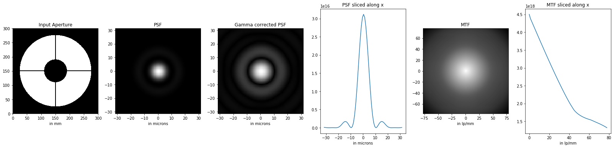

# Fourier_Optic
Python scripts doing Fourier optics

First we generate an aperture mask in a numpy array to represent the aperture of a telescope or lens, then, at a given wavelength, at focus, for that aperture we solve Fraunhofer 
diffraction equation numerically using Fourier transform.

Second we plot the PSF (3D raw, 3D gamma corrected to see the Airy disk better and in 2D slice) and MTF (3D and 2D slice) to evaluate the results. Finaly we calculate the exact size of the Airy disk for an equivalent round unobstructed aperture.

Usage: python Fourier_Optics_PSF_MDF_of_Aperture.py

Some useful tips:
 - the support array needs to be much bigger than the mask to avoid
 artefacts in the Fourier tansform.
 - if new to fft in python, read and understand fftflip doc.
 - with cv2, arrays needs to be normalized before saving to image, 
 otherwise you may end up with an all black image while the pyplot looks fine.
 - calculating PSF on pixels is easy. The somewhat tricky part is to correctly 
 assign physical units. This is a good read on the subject:
 https://www.strollswithmydog.com/wavefront-to-psf-to-mtf-physical-units/

Also check:
http://aberrator.astronomy.net/

More at: 
  https://erellaz.com/
  

